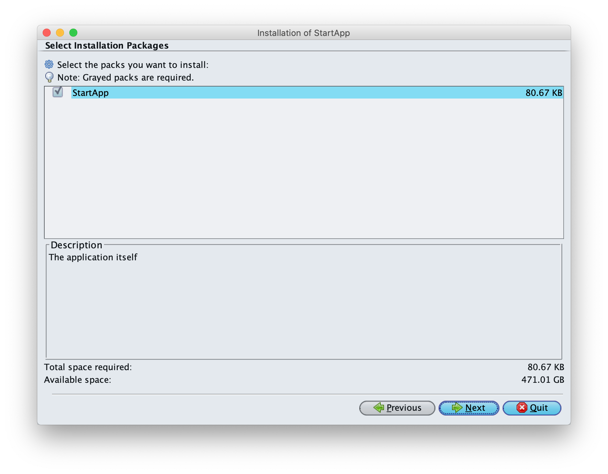
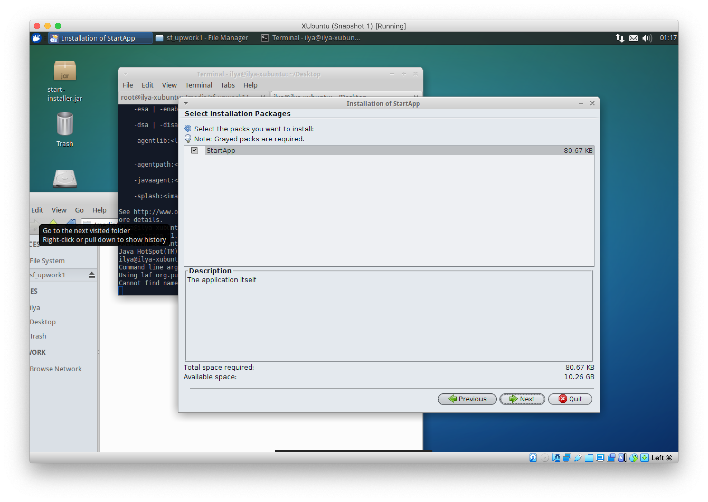
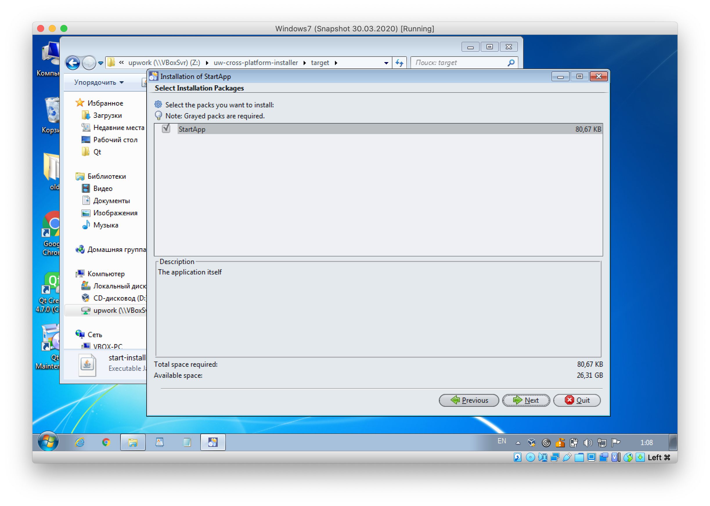

# uw-cross-platform-installer

The project is aimed to pack executable jar file with external (non-bundled) resources into a cross-platfrom installer (based on [IzPack](http://izpack.org))

## To create an installer:
- place jar file with any amount of files into **assets** directory
- modify pom.xml's **properties** below the `<!-- Installer variables -->` to make them correspond to your variables
- run `mvn package`
- the installer is created **target/${finalName}-installer.jar**

## Screenshots 

