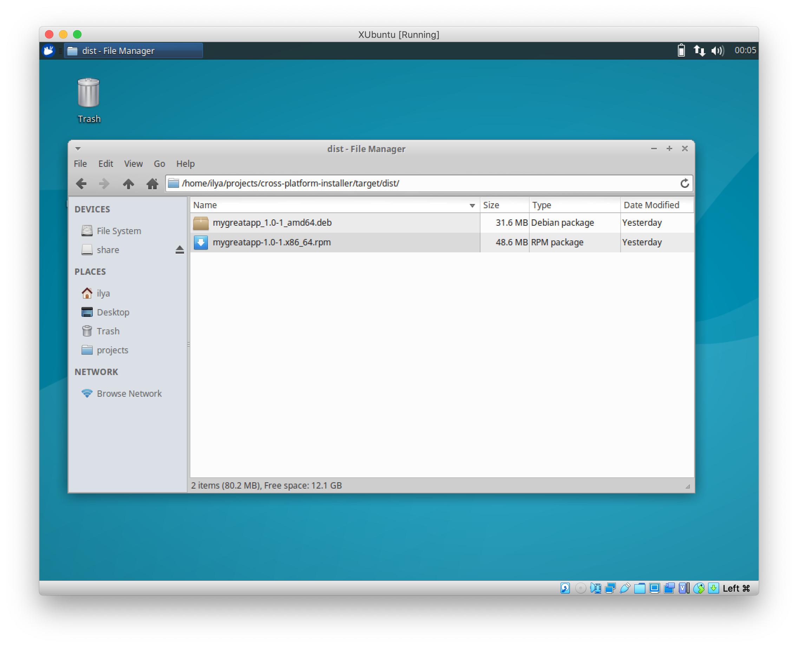

# cross-platform-installer

The project is aimed to pack executable jar file with external (non-bundled) resources into a cross-platfrom installer (based on [jpackage](https://openjdk.java.net/jeps/343) - a Packaging Tool from JDK 14)

The installer for desired platform (MacOS, Windows, Linux) could be build only on target platform only.

## Prerequisites
Native packages will be generated using tools on the target platform. You should install additional software before creating an installer
- for Windows: 
    - [Wix](https://wixtoolset.org), a third-party tool, is required to generate msi or exe packages
- for Linux:
    - fakeroot and beanutils, rpm. They could be installed (on Debian, Ubuntu) simply 
    ```
    apt-get -y install fakeroot
    apt-get -y install binutils
    apt-get -y install rpm
   ```  

## To package an installer:
- place jar file with any amount of files into **assets** directory
- modify file `jpackage.properties` in order to reflect your data in application - name, main jar, main class etc. 
- run `mvn package`
- the installer is created `target/dist/${app.name}-{app.version}.{ext}`, 
  where `{ext}` is the installer's file extension. It is platform-dependent
    - for MacOS - `.pkg` and `.dmg`
    - for Windows - `.exe` and `.msi`
    - for Linux - `.deb` and `.rpm`
   

## Screenshot 
### MacOS Screenshots
* Generated installers - `.pkg` and `.dmg` in `target/dist` directory

* DMG installer in action


* PKG installer in action


* Inside /Applications/MyGreatApp.app/


### Windows Screenshots
* Generated installers - `.exe` and `.msi` in `target/dist` directory

* Installer in action


* Inside C:\Program Files\MyGreatApp\

* Uninstaller in action


### Linux Screenshots
* Generated installers - `.deb` and `.pkg` in `target/dist` directory

* DEB Installer in action


* Inside /opt/mygreatapp/

* Uninstaller in action

